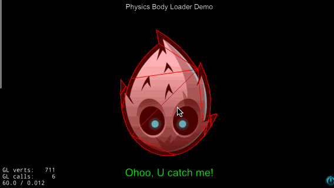
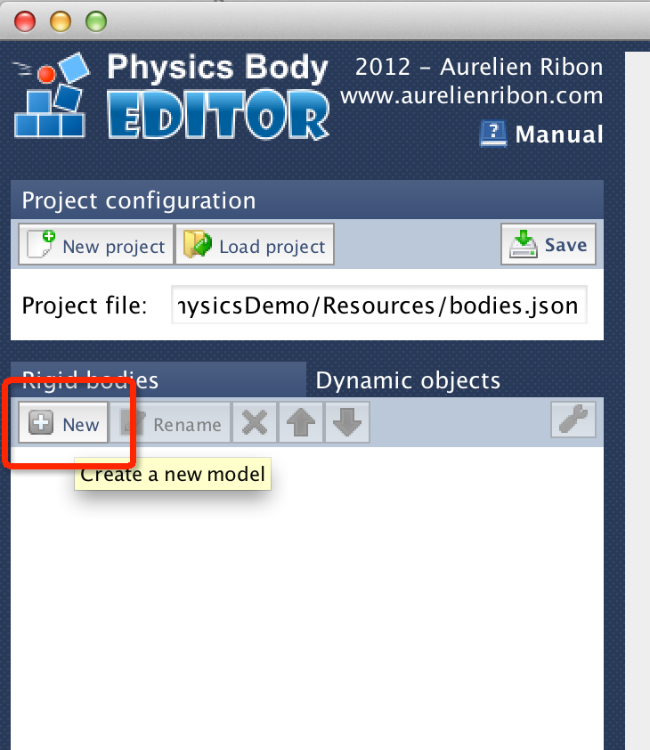
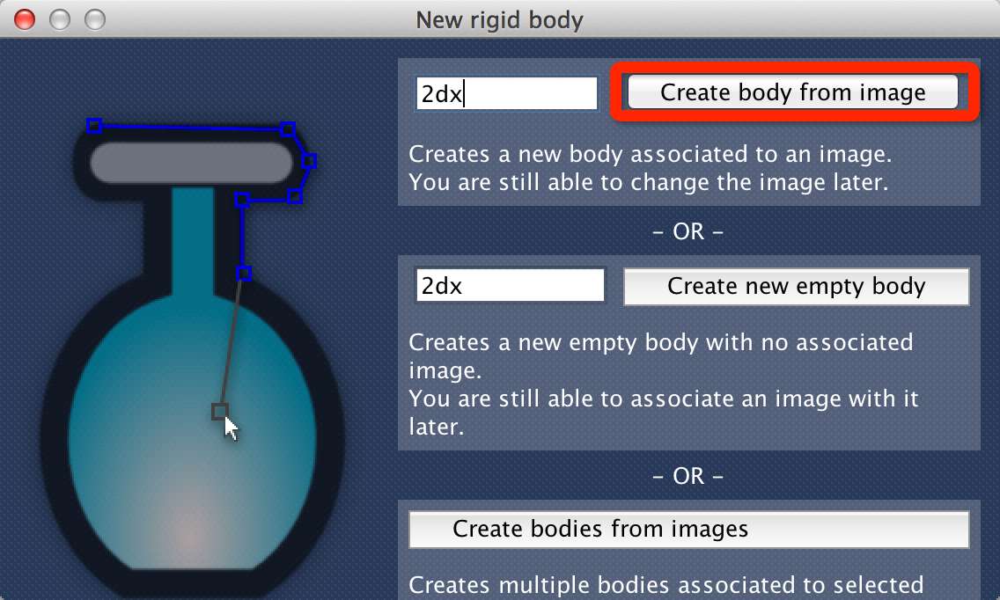
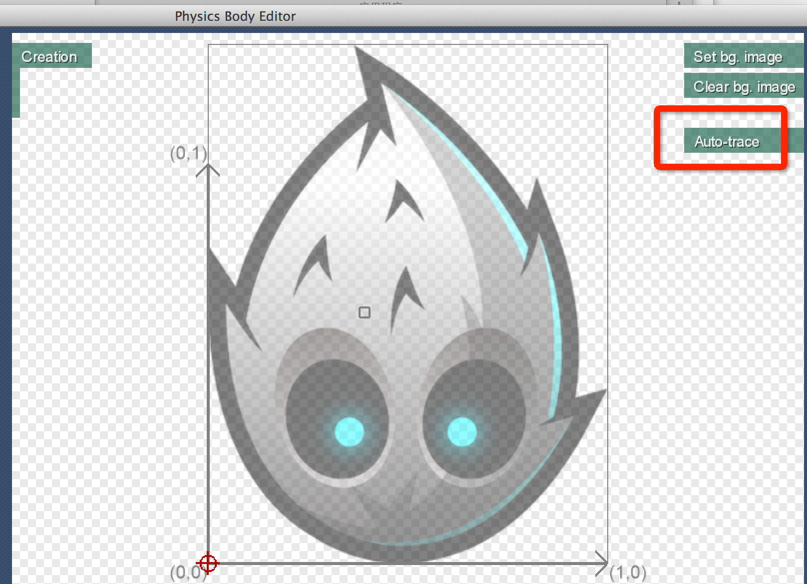
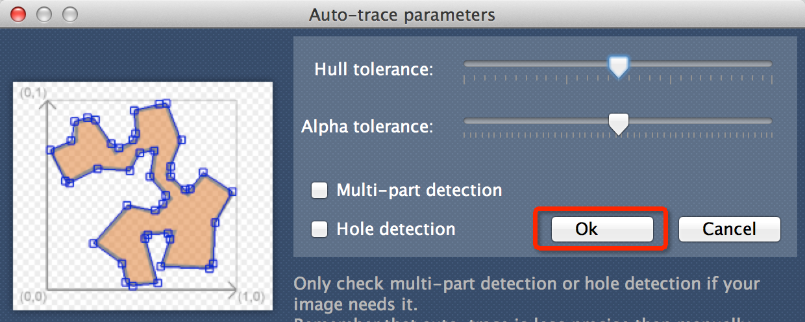
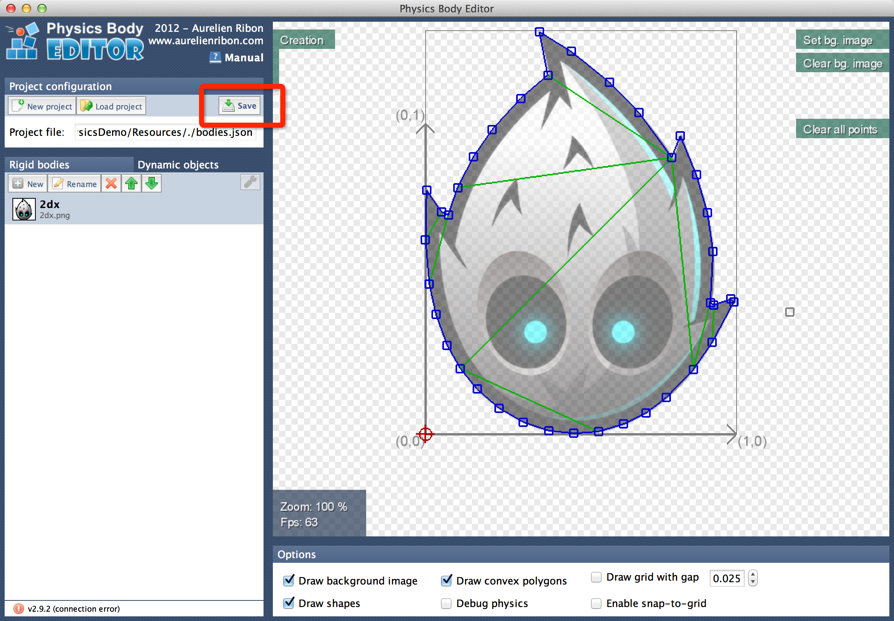

#Accurate hit testing with Cocos2d-x 3.0 integrated physics feature.

Cocos2d-x 3.0 version has an integrated physics feature based on chipmunk. It's very easy to make accurate hit testing in our cocos2d-x game.

####How to run?
Clone source code, and copy cocos2d-x 3.0 version files under `cocos2d`, the project looks like:

open proj.ios_mac/PhysicsDemo.xcodeproj to build for ios or mac

run `proj.android/build_native.py` to build for android.

I have put prbuilt files under 	`prebuilt编译好的`, please checkout and test.

####Basic principle

There is an open source body editor https://code.google.com/p/box2d-editor/ , with this free&powerful tool we can get  physicsbody polygons of an sprite. Then we import the polygons data into game and let the physics engine handle the rest thing.
All we need is to write an parse function which can load file exported by [box2d-editor] to cocos2d-x physics system.

Here we go.

####1.create new project:

	cocos new  -p com.example.phy -l cpp -d ~/Documents PhysicsDemo

####2.open the new project in xcode(I use xcode, chose your favorite IDE)
	open ~/Documents/PhysicsDemo/proj.ios_mac/PhysicsDemo.xcodeproj

####3.make an image for test, I have downloaded the cocos2d-x logo from  
	http://www.cocos2d-x.org/wiki/Logo_Resources_of_Cocos2d-x
name it as `2dx.png`, add the image to project.

####4.download box2d-editor
	https://code.google.com/p/box2d-editor/
	
get a jar file, open it.

Node: please use JRE6 to run it.
####5.get the body data

open the editor, create one new project, name `bodies.json` and save under the project's Resource.

Don't forget add`bodies.json` to project.

Create new body definition, name it `2dx`.

Use `Auto-trace` to get the image edge.

Save `bodies.json`

Next, we should write some code to import `bodies.json`.

####6.modify our scene

Edit method `HelloWorld::createScene` to enable physics feature.

	auto scene = Scene::createWithPhysics();
	//enable debug draw
	scene->getPhysicsWorld()->setDebugDrawMask(PhysicsWorld::DEBUGDRAW_ALL);

Add our sprite to the layer:
	
		// add "2dx.png"
	    sp_2dx = Sprite::create("2dx.png");
	    // position the sprite on the center of the screen
	    sp_2dx->setPosition(Point(visibleSize.width/2 + origin.x, visibleSize.height/2 + origin.y));
	    //load
	    MyBodyParser::getInstance()->parseJsonFile("bodies.json");
	    //bind physicsbody to sprite
	    auto _body = MyBodyParser::getInstance()->bodyFormJson(sp_2dx, "2dx");
	    if (_body != nullptr) {
	        _body->setDynamic(false); //set it static body.
	        _body->setCollisionBitmask(0x000000); //don't collision with anybody.
	        sp_2dx->setPhysicsBody(_body);
	    }
	    // add the sprite as a child to this layer
	    this->addChild(sp_2dx, 0);

MyBodyParser is the helper class to load `bodies.json`, use rapidjson.
You can check the detailes in source code, key function is `MyBodyParser::bodyFormJson`.

Then, add touchListener, this's simple and nothing interesting to waste words.

####7.check whether our sprite is clicked

In function `HelloWorld::nodeUnderTouch`:

	Node* HelloWorld::nodeUnderTouch(cocos2d::Touch *touch)
	{
	    Node* node = nullptr;
	    //translate the touch to layer coordinate.
	    auto location = this->convertTouchToNodeSpace(touch);
		
	    //retrive all physics shapes under the touch location though cocos2d-x.
	    auto scene = Director::getInstance()->getRunningScene();
	    auto arr = scene->getPhysicsWorld()->getShapes(location);
		
	    //iterate the shapes, find our sprite!
	    for (auto& obj : arr)
	    {
	        //find it!!!!
	        if ( obj->getBody()->getNode() == sp_2dx)
	        {
	            node = obj->getBody()->getNode();
	            break;
	        }
	    }
	    return node;
	}
	
If this function return nullptr, means you havn't touch inside the Sprite's physics body.

This's all the magic, Checkout the source code and read more.
